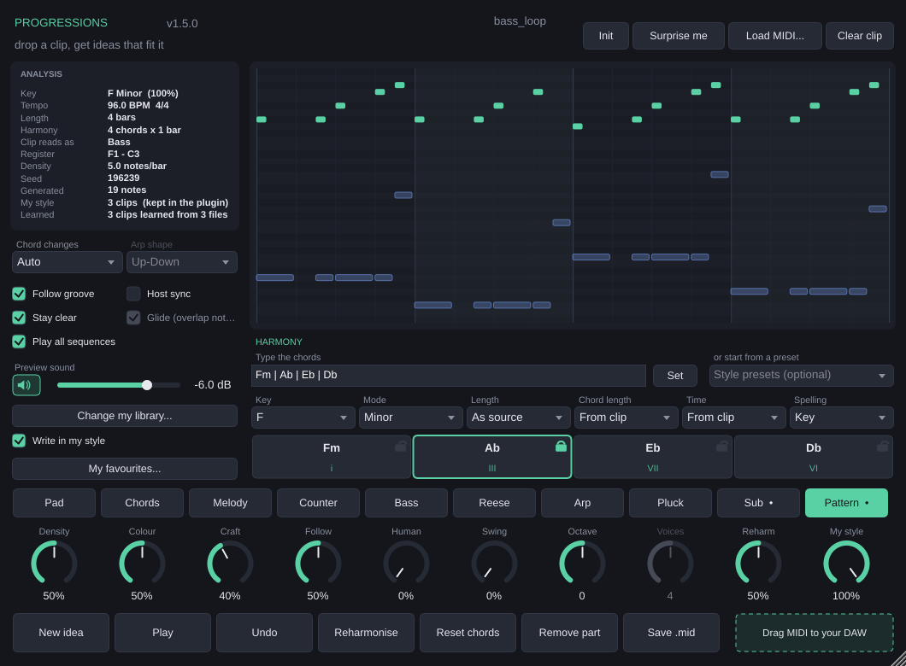

# Harmonia

Plugin **VST 3** (e app standalone) para gerar ideias musicais a partir da sua
própria harmonia. Três caminhos, todos levando ao mesmo lugar:

1. **Solta um MIDI** — baixo, pad, lead, pluck — e o plugin descobre a
   progressão que está por trás dele.
2. **Digita a progressão** que você quer: `Am | F | C | G` ou `i VI III VII`.
3. **Escolhe um preset** de House, Deep House, Melodic House ou Afro House.

Com a harmonia definida, ele escreve pads, melodias, contracantos, baixos,
arpejos e plucks em cima dela — e você arrasta o resultado direto para o DAW.



---

## Índice

- [O que ele faz](#o-que-ele-faz)
- [Escrevendo a progressão](#escrevendo-a-progressão)
- [Sua biblioteca de MIDIs](#sua-biblioteca-de-midis)
- [O cérebro: escrever no seu estilo](#o-cérebro-escrever-no-seu-estilo)
- [Instalando](#instalando)
- [Rodando na sua máquina](#rodando-na-sua-máquina)
- [Usando no DAW](#usando-no-daw)
- [Linha de comando](#linha-de-comando)
- [Estrutura do projeto](#estrutura-do-projeto)

---

## O que ele faz

**Análise do clipe que você soltar**

| | |
|---|---|
| Tonalidade | Perfis de Temperley com viés para menor natural, ancorados nas notas que abrem e fecham o trecho. Detecta também Dórico, Mixolídio, Lídio e menor harmônica. |
| Progressão | Reconhecimento de acordes por Viterbi sobre 12 fundamentais × 10 qualidades, com bônus diatônico, bônus para a nota mais grave e penalidade por troca de acorde. |
| Papel do clipe | Baixo, pad/acordes, lead ou arpejo — e isso muda o resto da análise: um baixo monofônico ganha peso na fundamental, um lead ganha uma grade harmônica mais larga. |
| Ritmo | Grade de semicolcheias, densidade, sincopação, polifonia média e registro. É isso que faz a parte gerada respirar junto com a sua. |

**Geração**

| Parte | O que sai |
|---|---|
| **Pad** | Vozes sustentadas por acorde, com condução de vozes de verdade (busca pela inversão que menos se movimenta). |
| **Chords** | O mesmo material em bloco rítmico, seguindo o groove. |
| **Melody** | Linha construída sobre um motivo curto, repetido e variado em frases de 4 compassos, ancorada em notas do acorde nos tempos fortes. |
| **Counter** | Igual à melodia, mas empurrada para movimento contrário ao do clipe e proibida de dobrar as suas notas. |
| **Bass** | Fundamental com quintas, oitavas e aproximações cromáticas para o próximo acorde. |
| **Arp** | Notas do acorde em Up / Down / Up-Down / Down-Up / Converge / Random. |
| **Pluck** | Notas curtas do acorde em cima do groove, com saltos e oitavas dobradas nos acentos — o pluck de house. |

Com um *style model* carregado, todas essas partes passam a usar os compassos,
os movimentos e os espaçamentos aprendidos da sua coleção — veja
[O cérebro](#o-cérebro-escrever-no-seu-estilo).

**Reharmonização** — um clique troca acordes por relativas, dominantes
secundárias, substituições de trítono e empréstimo modal. Cada acorde também
pode ser empurrado na mão: clique no chip para subir um grau, botão direito para
descer.

**Saída** — arraste o resultado direto para a timeline do DAW, salve como `.mid`,
ou use a saída MIDI do plugin para tocar num instrumento seu. Tem um sintetizador
de preview embutido para ouvir sem ligar nada.

---

## Escrevendo a progressão

O campo de texto embaixo da régua de acordes aceita as duas notações, misturadas
se você quiser:

```
Am | F | C | G                   cifras
i - VI - III - VII               graus (na tonalidade atual)
Cm7 Fm7 Bb7 Ebmaj7               espaço também separa
i9 | IV9                         graus com extensão
F#m7b5 | B7 | Em                 acidentes e qualidades completas
```

Reconhece `m`, `maj7`, `m7`, `7`, `9`, `maj9`, `m9`, `6`, `m6`, `dim`, `dim7`,
`m7b5`, `aug`, `sus2`, `sus4`, `7sus4`, `add9`, `5` e inversões com `/`
(`Cmaj7/G`). Nos graus, **maiúscula é acorde maior e minúscula é menor** — `V`
em Lá menor é Mi maior, `v` é Mi menor.

Os graus são contados **na escala da própria tonalidade**: em Lá menor,
`i VI III VII` é `Am F C G`. É a notação que produtor usa, não a do
conservatório (que escreveria `i bVI bIII bVII`).

**Com um clipe carregado**, escrever uma progressão troca só os acordes: andamento,
compasso, tamanho e groove continuam sendo os do clipe. Ou seja, dá para pegar
um baixo que você gosta e experimentar outra harmonia por cima dele.

**Sem clipe nenhum**, a progressão vira o material inteiro — um compasso por
acorde, no andamento do DAW.

O combo **Style presets** traz 20 progressões prontas, escritas em graus e por
isso transportáveis para qualquer tom. O preset mantém a tônica em que você já
está e só troca o modo (não adianta aplicar `vi IV I V` numa tonalidade menor).

```
$ harmonia-cli presets --style melodic

Melodic House
  melodic-lift          Melodic lift          i | III | VII | VI
                        Minor - The Anjuna-style four - lands well under long arpeggios.
  melodic-drive         Driving minor         i | VII | VI | VII
                        Minor - Keeps moving without resolving; good under a rolling bass.
  ...
```

O combo **Key** fixa a tonalidade em vez de deixar o detector escolher — é ela
que decide como os graus que você digitar são lidos.

---

## Sua biblioteca de MIDIs

O `scan` percorre uma pasta inteira, analisa cada `.mid` e grava um índice JSON
com tonalidade, andamento, progressão, papel (bass/lead/pad/pluck/arp) e o perfil
rítmico de cada clipe. As pastas viram etiquetas, então a organização que você já
tem no HD passa a ser pesquisável.

O papel sai do caminho do arquivo, do indício mais próximo para o mais distante:
primeiro o nome do arquivo (incluindo os prefixos que os packs usam — `BS`, `LD`,
`CH`, `PD`, `ARP`, `PL`), depois a pasta onde ele está, depois a pasta acima.
Títulos de pack e nomes de gênero são ignorados de propósito: `Melodic House &
Techno` não faz de todo clipe do pack um lead, e `Deep House` não é um baixo.

```bash
harmonia-cli scan "/Volumes/HD Externo/MIDI" --index ~/harmonia-library.json
```

```
Walked 412 folders, 3184 files
  MIDI files found : 2841
  Indexed          : 2790
  Unreadable       : 51
  System files     : 2790   (macOS "._" twins e ocultos, ignorados)
  Other files      : .wav(210) .als(41) .zip(9)

Indexed 2790 clips into /Users/você/harmonia-library.json
  Percussion     : 412
  By role        : arp=233 bass=486 chords=390 drums=412 lead=507 pad=381 pluck=432
  Top folders    : deep house(612) melodic house(548) bass(486) leads(507) ...
```

O cabeçalho existe justamente para você conferir se ele pegou tudo. Se o número
de MIDIs encontrados for menor do que você esperava:

```bash
# conta sem ler nada, é instantâneo
harmonia-cli scan "/Volumes/HD Externo/MIDI" --dry-run

# compare com o que o próprio macOS enxerga
find "/Volumes/HD Externo/MIDI" -iname "*.mid" -o -iname "*.midi" | wc -l
```

Se os dois números baterem, ele achou tudo. Se o `find` achar mais, o motivo
costuma estar na linha `Other files` (coleção ainda dentro de `.zip`, ou em
formato que não é MIDI solto) ou em pastas que são *alias*/symlink — nesse caso
use `--follow-symlinks`. `Folders refused` aponta problema de permissão.

Em pendrive ou HD formatado em **exFAT/FAT32**, o macOS cria um gêmeo `._nome.mid`
para cada arquivo copiado. Eles casam com a extensão mas são lixo de resource
fork — o scan os ignora e reporta na linha `System files`, junto com `__MACOSX`,
`.Trashes` e outras pastas de sistema. Por isso o `find` costuma contar o dobro
do que o Harmonia indexa; para comparar de verdade, filtre:

```bash
find "/Volumes/KINGSTON" \( -iname "*.mid" -o -iname "*.midi" \) \
     ! -name "._*" ! -path "*/__MACOSX/*" | wc -l
```

Depois:

```bash
# tudo que é baixo de deep house em Fá menor entre 118 e 124 BPM
harmonia-cli library --index ~/harmonia-library.json \
    --tag "deep house" --role bass --key "F minor" --bpm 118-124

# que progressões aparecem na minha coleção?
harmonia-cli library --index ~/harmonia-library.json --contains "VI | VII"

# um mapa das pastas
harmonia-cli library --index ~/harmonia-library.json --tags
```

E o principal: **usar um clipe da biblioteca como doador de groove**. A harmonia
vem da progressão, o ritmo vem de um clipe seu:

```bash
harmonia-cli --preset deep-rhodes --key "F minor" \
    --index ~/harmonia-library.json \
    --groove "dh_bass_01" \
    --part pluck,pad --out ideias/
```

O `--groove` aceita tanto um caminho `.mid` quanto um pedaço de nome/pasta que é
procurado no índice.

---

## O cérebro: escrever no seu estilo

Catalogar é uma coisa; **aprender** é outra. O mesmo `scan` que monta o índice
também constrói um *style model*: uma destilação estatística de como a sua
coleção se comporta.

```bash
harmonia-cli scan "/Volumes/HD Externo/MIDI" --index ~/harmonia-library.json
```

```
Learned a style model into /Users/você/harmonia-library.style.json
  2841 clips, 11204 bars, 312 melody bars, 198 bass bars, 274 pluck bars,
  156 chords bars, 141 voicings, 200 progressions
  Your most common progressions:
    i | VI | III | VII                      184 clips
    i | VII | VI | VII                      121 clips
```

### O que ele aprende

| | |
|---|---|
| **Compassos** | Cada compasso da sua coleção vira uma máscara de 16 semicolcheias, com velocity e duração por posição — separado por papel (bass, lead, pluck, chords, arp). É por isso que um baixo gerado cai nas mesmas semicolcheias que os seus. |
| **Movimento melódico** | Cadeia de Markov sobre **passos de escala**, não sobre notas: `passo anterior → próximo passo`. Como é medido em graus, transporta para qualquer tom. |
| **Intervalos sobre a fundamental** | O que você toca sobre a raiz, separado pela força métrica da semicolcheia (cabeça de compasso / tempo / contratempo de colcheia / de semicolcheia). É o que faz um baixo gerado ter o *seu* vocabulário de oitavas e quintas. |
| **Espaçamento de acordes** | As distâncias entre as vozes dos seus pads. |
| **Progressões** | Quais encadeamentos aparecem na sua coleção, e com que frequência. |

### O que ele **não** faz

Ele **não guarda frases suas**. O que fica no arquivo são contagens — quantas
vezes um compasso tinha ataque na semicolcheia 7, quantas vezes um passo de +2
foi seguido de −1. Nada é reproduzido literalmente, e o `.style.json` não contém
MIDI: dá para versionar e compartilhar sem carregar material de ninguém junto.

Os espaçamentos de acorde também não trazem harmonia errada: eles são aplicados
como *molde* e depois encaixados nas notas do acorde que está tocando. Um
espaçamento tirado de um acorde maior, usado sobre um menor, mantém a abertura e
o registro — mas a terça continua sendo a do acorde certo.

### Usando

No **CLI**:

```bash
harmonia-cli --preset melodic-lift --key "F minor"     --style ~/harmonia-library.style.json     --part bass,melody,pluck --out ideias/
```

`--style-amount 0.5` mistura meio a meio com o feel interno; `0` ignora o
modelo. E para ver o que a sua coleção anda tocando:

```bash
harmonia-cli library --index ~/harmonia-library.json --progressions
```

No **plugin**: **Learn from my library…** carrega o `.style.json`, o toggle
**Write in my style** liga, e o botão **My style** dosa o quanto. O caminho do
modelo fica salvo no projeto.

### Um cérebro por gênero

O modelo é global — ele mistura tudo que você mandou escanear. Se você quiser
que Deep House e Melodic House não se contaminem, escaneie separado:

```bash
harmonia-cli scan "/Volumes/HD/MIDI/Deep House"    --index ~/deep.json
harmonia-cli scan "/Volumes/HD/MIDI/Melodic House" --index ~/melodic.json
```

Cada scan produz o seu próprio `.style.json`, e você escolhe qual carregar.

### Uma ressalva honesta

Testei isso contra corpora sintéticos que eu mesmo construí — sei que o modelo
aprende e reproduz o que foi ensinado (há testes que provam isso: um corpus que
só toca nas semicolcheias 0 e 6 gera baixos só nessas posições). O que eu **não**
pude testar é como soa com MIDI de house de verdade, porque o seu HD não está
aqui. É bem possível que a dosagem precise de ajuste depois do primeiro contato
com material real — me diga o que sair.

### Onde guardar os MIDIs

Recomendo **deixar os arquivos no HD e versionar só o índice**: ele é um JSON de
alguns MB que descreve a coleção inteira e não carrega áudio nem MIDI de
terceiros junto. A pasta `library/` já está no `.gitignore` caso você prefira
copiar uma seleção para dentro do projeto.

Uma ressalva prática: MIDI pack comprado quase sempre vem com licença que proíbe
redistribuição. Os seus MIDIs, feitos por você, são seus — esses pode subir sem
problema. Os de pack, melhor manter fora de um repositório público.

---

## Instalando

### Linux

```bash
sudo apt install build-essential cmake ninja-build \
    libx11-dev libxrandr-dev libxinerama-dev libxcursor-dev libxext-dev \
    libxcomposite-dev libasound2-dev libfreetype-dev libfontconfig1-dev \
    libgl1-mesa-dev

git clone --depth 1 --branch 8.0.6 https://github.com/juce-framework/JUCE.git external/JUCE
cmake -S . -B build -G Ninja -DCMAKE_BUILD_TYPE=Release -DHARMONIA_BUILD_PLUGIN=ON
cmake --build build
```

O `.vst3` fica em `build/plugin/Harmonia_artefacts/Release/VST3/Harmonia.vst3`.
Copie para `~/.vst3/`.

### macOS

```bash
brew install cmake ninja
git clone --depth 1 --branch 8.0.6 https://github.com/juce-framework/JUCE.git external/JUCE
cmake -S . -B build -G Ninja -DCMAKE_BUILD_TYPE=Release -DHARMONIA_BUILD_PLUGIN=ON
cmake --build build
```

Copie o `.vst3` para `~/Library/Audio/Plug-Ins/VST3/`. Para gerar AU também,
acrescente `AU` em `FORMATS` no `plugin/CMakeLists.txt`.

### Windows

```powershell
git clone --depth 1 --branch 8.0.6 https://github.com/juce-framework/JUCE.git external/JUCE
cmake -S . -B build -DHARMONIA_BUILD_PLUGIN=ON
cmake --build build --config Release
```

Copie o `.vst3` para `C:\Program Files\Common Files\VST3\`.

> Passe `-DHARMONIA_INSTALL_PLUGIN=ON` e o CMake copia sozinho para a pasta de
> plugins do sistema no fim do build. Se você não clonar o JUCE à mão, o CMake
> baixa via `FetchContent` (só demora mais).

---

## Rodando na sua máquina

O projeto está no GitHub; o container onde ele foi escrito é descartável.
Para trazer tudo para o seu computador:

```bash
git clone https://github.com/andrebeltrame/claudeapp.git harmonia
cd harmonia
git checkout claude/vst3-music-idea-generator-vqgacc
```

Daí siga a seção [Instalando](#instalando). Só o motor + CLI, sem o plugin, é
questão de segundos e não precisa de nenhuma dependência:

```bash
cmake -S . -B build -G Ninja -DCMAKE_BUILD_TYPE=Release
cmake --build build
./build/tests/harmonia_tests
```

---

## Usando no DAW

1. Abra o Harmonia como **instrumento** numa pista.
2. Arraste um `.mid` para a janela, ou digite uma progressão, ou escolha um preset.
3. Confira o painel de análise e a régua de acordes.
4. Escolha a parte (**Pad**, **Melody**, **Pluck**, …) e mexa nos botões.
5. **New idea** sorteia outra versão com as mesmas configurações.
6. **Drag MIDI to your DAW** arrasta o resultado para a timeline.

Detalhes que valem saber:

- **Follow groove** faz a parte nova herdar o padrão rítmico do clipe. Desligue
  se o clipe for um pad de semibreves e você quiser algo mexido.
- **Stay clear** mantém a parte nova fora do registro que o clipe já ocupa —
  é o que impede um pad de subir em cima do lead.
- **Host sync** toca junto com o transporte do DAW; desligado, o botão **Play**
  roda em loop no andamento do próprio clipe.
- **Length** repete a progressão até completar 1, 2, 4, 8 ou 16 compassos.
- **Chord changes** força a grade harmônica. Em *Auto* o plugin decide; se ele
  achar um acorde só num lead que você sabe que tem quatro, force *1 per bar*.
- A **semente** aparece no painel: mesma semente + mesmos controles = exatamente
  a mesma ideia, sempre. Ela é salva no projeto, junto com o clipe e a progressão.

---

## Linha de comando

```bash
harmonia-cli <arquivo.mid> [opções]      analisa um clipe e escreve partes
harmonia-cli --progression "Am F C G"    escreve sobre acordes digitados
harmonia-cli --preset deep-warm          escreve sobre um preset
harmonia-cli presets [--style X]         lista as progressões prontas
harmonia-cli scan <pasta> [opções]       indexa uma pasta de MIDIs
harmonia-cli library [opções]            pesquisa o índice
```

```
$ harmonia-cli resources/examples/bass_loop.mid --info
Analysed resources/examples/bass_loop.mid
  Key            : A Minor  (confidence 0.53)
  Tempo          : 96.0 BPM
  Detected role  : Bass
  Progression    : Am | F | C | G
  Roman numerals : i | VI | III | VII
```

Principais opções de geração: `--part`, `--progression`, `--preset`, `--groove`,
`--style`, `--style-amount`,
`--variations`, `--bars`, `--bpm`, `--density`, `--complexity`, `--humanize`,
`--swing`, `--octave`, `--voices`, `--seed`, `--key`, `--reharm`,
`--chords-per-bar`, `--no-follow`, `--no-avoid`, `--info`.
`harmonia-cli --help` tem a lista completa.

---

## Estrutura do projeto

```
core/      motor em C++17, sem dependência nenhuma (nem JUCE)
           MIDI, teoria, análise, geradores, progressões, presets,
           biblioteca e o modelo de estilo
cli/       front end de linha de comando
tests/     70 testes unitários do motor
plugin/    invólucro JUCE: processador, editor, componentes de UI
           tests/ traz um smoke test headless do plugin
resources/ clipes MIDI de exemplo
docs/      como o motor funciona por dentro
```

O motor não conhece o JUCE. Isso mantém a análise e a geração testáveis em
segundos, sem abrir DAW nenhum — e permite reaproveitar o mesmo código em outro
invólucro (AU, CLAP, um app web via WASM) sem reescrever nada.

## Rodando os testes

```bash
cmake -S . -B build -G Ninja -DCMAKE_BUILD_TYPE=Release
cmake --build build && ./build/tests/harmonia_tests
```

Com `-DHARMONIA_BUILD_PLUGIN=ON` o alvo `harmonia_plugin_tests` também é
construído: ele instancia o plugin, roda 400 blocos de áudio, confere que todo
note-on tem note-off, testa progressões digitadas e presets, faz round-trip do
estado e renderiza a interface em PNG.

## Licença

O código deste repositório é seu. O JUCE é licenciado à parte — veja
[juce.com/juce-licence](https://juce.com/juce-licence). Compilando sob a licença
pessoal do JUCE, o plugin exibe o splash screen do JUCE ao abrir.
